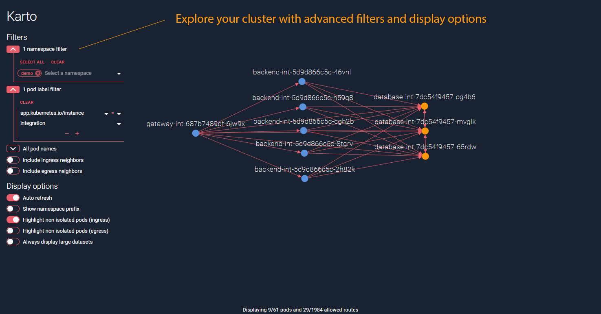

# Karto

A simple static analysis tool to explore and diagnosticate network policies declared in a Kubernetes cluster.



## How to use

The left part of the screen contains the controls for the main view:
- Filters: filter pods by namespace, labels and name
- Include ingress neighbors: display pods that can reach those in the current selection 
- Include egress neighbors: display pods that can be reached by those in the current selection
- Auto refresh: refresh the view every 5 seconds
- Show namespace prefix: include the namespace in pod names
- Highlight non isolated pods (ingress/egress): color pods with no ingress/egress network policy
- Always display large datasets: always try to display large sets of pods and routes (may slow down your browser)

The main view shows the graph of pods and allowed routes in your selection:
- Zoom in and out by scrolling
- Drag and drop pods to draw the perfect map of your cluster

Hover over a pod to display details:
- Name, namespace and labels
- Isolation (ingress/egress)

Hover over a route to investigate allowed traffic:
- Source/target pod
- Ports
- Explanation (lack of isolation or network policies allowing traffic)


## Run inside your cluster

### Deployment
Simply apply the provided descriptor:
```shell script
kubectl apply -f deploy/k8s.yml
```
This will:
- create a `karto` namespace
- create a `karto` service account with a role allowing to list all pods, namespaces and network 
policies in the cluster
- deploy an instance of the application in this namespace with this service account

### Exposition
Once deployed, the application must be exposed. For a quick try, use `port-forward`:
```shell script
kubectl -n karto port-forward <pod name> 8000:8000
```
The will exposed the app on your local machine on `localhost:8000`.

For a long-term solution, investigate the use of a [LoadBalancer service](
https://kubernetes.io/docs/concepts/services-networking/service/#publishing-services-service-types) or an [Ingress](
https://kubernetes.io/docs/concepts/services-networking/ingress/).

Remember to always secure the access to the application as it obviously displays sensitive data about your cluster. 

### Cleanup
Delete everything using the same descriptor:
```shell script
kubectl delete -f deploy/k8s.yml
```


## Run locally

### Prerequisites
The following tools must be available locally:
- [Go](https://golang.org/doc/install)
- [NodeJS](https://nodejs.org/en/download/) 

### Frontend
To run in development mode: 
```shell script
npm start
```
This will expose the app in dev mode on `localhost:3000` with a proxy to `localhost:8000` for the API calls.

To compile: 
```shell script
npm run build
```
This will generate a `build` folder in `/front` that can be served statically.

### Backend
To build the main executable: 
```shell script
go build karto
```
This executable runs on port 8080 and serves the content of `./front/build` on the `/` route and the API on the `/api`
route. If you choose not to run the frontend in development mode, remember to always refresh the frontend content (if 
modified) using the npm `build` command described above.  


## Test suites

### Backend
To run the entire test suite: 
```shell script
go test ./...
```
