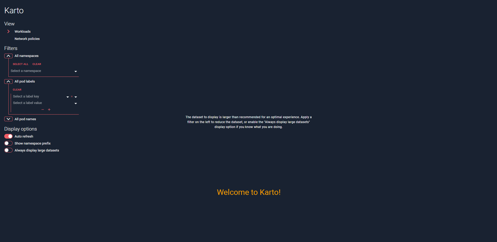
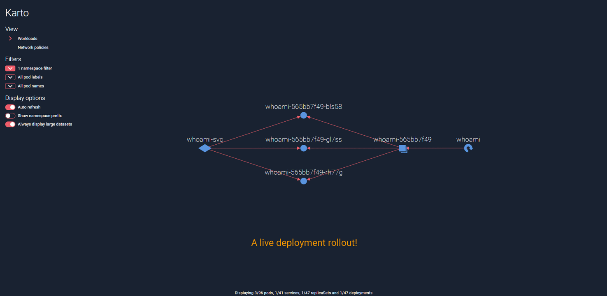

# Karto

A simple static analysis tool to explore a Kubernetes cluster.


## Explore you cluster interactively!



## Observe your cluster change in real time!



## Diagnosticate network policies


## Main features

The left part of the screen contains the controls for the main view:

- View: choose your view
    - Workloads: deployments, controllers, pods, services, ingresses... and how they interact with each other
    - Network policies: network routes allowed between pods, based on network policy declarations
    - Health: health information about the pods
- Filters: filter the items to display
    - by pod namespace
    - by pod labels
    - by pod name
    - \[Network policies view only\] Include ingress neighbors: also display pods that can reach those in the current
      selection
    - \[Network policies view only\] Include egress neighbors: also display pods that can be reached by those in the
      current selection
- Display options: customize how items are displayed
    - Auto-refresh: automatically refresh the view every 2 seconds
    - Auto-zoom: automatically resize the view to fit all the elements to display
    - Show namespace prefix: add the namespace to the name of the displayed items
    - Always display large datasets: try to render the data even if the number of item is high (may slow down your
      browser)
    - \[Network policies view only\] Highlight non isolated pods (ingress): color pods with no ingress network policy
    - \[Network policies view only\] Highlight non isolated pods (egress): color pods with no egress network policy
    - \[Health view only\] Highlight pods with container not running: color pods with at least one container not running
    - \[Health view only\] Highlight pods with container not ready: color pods with at least one container not ready
    - \[Health view only\] Highlight pods with container restarted: color pods with at least one container which
      restarted

The main view shows the graph or list of items, depending on the selected view, filters and display options:

- Zoom in and out by scrolling
- Drag and drop graph elements to draw the perfect map of your cluster
- Hover over any graph element to display details: name, namespace, labels, isolation (ingress/egress)... and more!

In the top left part of the screen you will find action buttons to:

- Export the current graph as PNG to use it in slides or share it
- Go fullscreen and use Karto as an office (or situation room) dashboard!

## Installation

There are two ways to install and run Karto:

- To deploy it inside the Kubernetes cluster to analyze, proceed to the
  [Run inside a cluster](#run-inside-a-cluster) section.
- To run it on any machine outside the Kubernetes cluster to analyze, refer to the
  [Run outside a cluster](#run-outside-a-cluster) section.

### Run inside a cluster

#### Deployment

Simply apply the provided descriptor:

```shell script
kubectl apply -f deploy/k8s.yml
```

This will:

- create a `karto` namespace
- create a `karto` service account with a role allowing to watch the resources displayed by Karto (namespaces, pods,
  network policies, services, deployments...)
- deploy an instance of the application in this namespace with this service account

#### Exposition

Once deployed, the application must be exposed. For a quick try, use `port-forward`:

```shell script
kubectl -n karto port-forward <pod name> 8000:8000
```

The will exposed the app on your local machine on `localhost:8000`.

For a long-term solution, investigate the use of a [LoadBalancer service](
https://kubernetes.io/docs/concepts/services-networking/service/#publishing-services-service-types) or an [Ingress](
https://kubernetes.io/docs/concepts/services-networking/ingress/).

*Remember to always secure the access to the application as it obviously displays sensitive data about your cluster.*

#### Cleanup

Delete everything using the same descriptor:

```shell script
kubectl delete -f deploy/k8s.yml
```

### Run outside a cluster

For this to work, a local `kubeconfig` file with existing connection information to the target cluster must be present
on the machine (if you already use `kubectl` locally, you are good to go!).

Simply download the Karto binary from the [releases page](https://github.com/Zenika/karto/releases) and run it!

## Development

### Prerequisites

The following tools must be available locally:

- [Go](https://golang.org/doc/install) (tested with Go 1.17)
- [NodeJS](https://nodejs.org/en/download/) (tested with NodeJS 14)

### Run the frontend in dev mode

In the `front` directory, execute:

```shell script
yarn start
```

This will expose the app in dev mode on `localhost:3000` with a proxy to `localhost:8000` for the API calls.

### Run the backend locally

In the `back` directory, execute:

```shell script
go build karto
./karto
```

### Test suites

To run the entire backend test suite, execute in the `back` directory:

```shell script
go test ./...
```

### Compile the go binary from source

In production mode, the frontend is packaged in the go binary using [embed](https://golang.org/pkg/embed/). In this
configuration, the frontend is served on the `/` route and the API on the `/api` route.

To compile the Karto binary from source, first compile the frontend source code. In the `front` directory, execute:

```shell script
yarn build
```

This will generate a `build` directory in `front`.

Then, make a copy in a directory visible by the backend module:

```shell script
cp -R front/build/* back/exposition/frontend
```

Finally, compile the go binary in the `back` directory:

```shell script
go build karto
```
